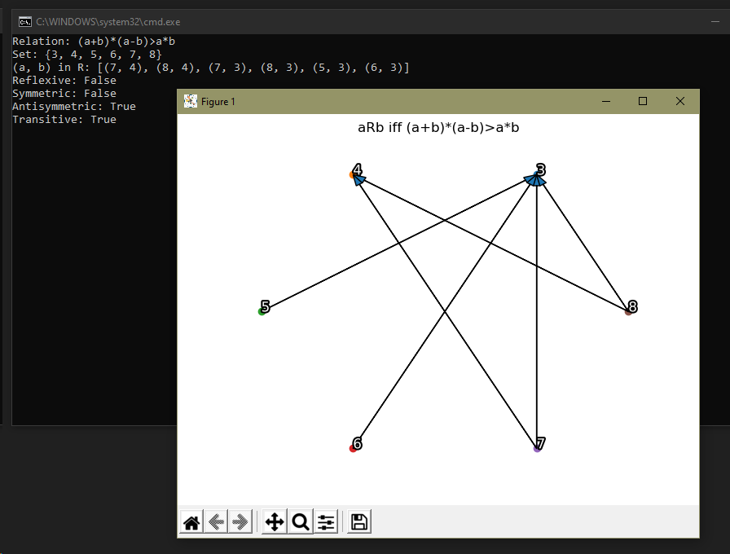

1) right-click and edit "plotAGraph.py"
2) scroll to the bottom and find the section starting with "if __name__ == "__main__":"
3) modify `rg.plot_relation("(a+b)*(a-b)>a*b", {3, 4, 5, 6, 7, 8})`. The string is the propositional function that ***MUST*** be in terms a and b. The curly braces are your set.

REQUIREMENTS
To use this, you must have matplotlib and numpy installed. Be sure to google how if you are unsure.

